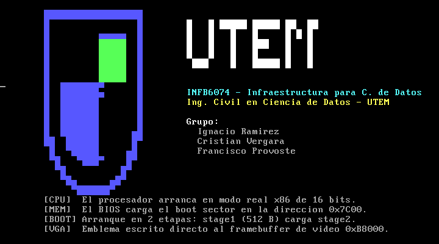

# Informe Técnico — Ejercicio 1: Mini sistema operativo booteable en ensamblador y QEMU

**Asignatura:** Infraestructura para Ciencia de Datos (INFB6074)
**Institución:** Universidad Tecnológica Metropolitana (UTEM)
**Carrera:** Ingeniería Civil en Ciencia de Datos
**Evaluación:** Evaluación Integradora 1 — Ejercicio 1
**Semestre:** Primer Semestre 2026
**Profesor:** Dr. Ing. Michael Miranda Sandoval
**Integrantes:** Ignacio Ramírez, Cristian Vergara y Francisco Provoste
**Repositorio:** [altairBASIC/micro-os-boot](https://github.com/altairBASIC/micro-os-boot)

---

## 1. Objetivo

Implementar un programa booteable mínimo en ensamblador x86 real mode que se ejecute en QEMU y muestre una pantalla institucional en modo caracteres más elaborada que un simple "Hola mundo". El ejercicio conecta fundamentos digitales, ciclo de arranque, arquitectura básica, abstracción hardware/software y el rol inicial del sistema operativo (semanas 1 y 2 del curso).

---

## 2. Fundamento técnico

### 2.1 Secuencia de arranque x86

Al encender la máquina, la CPU salta al *reset vector* (`0xFFFFFFF0`), donde reside el firmware. El BIOS ejecuta el **POST** (Power-On Self Test), inicializa dispositivos y construye la tabla de vectores de interrupción. Luego busca un dispositivo de arranque y lee su **primer sector** (512 bytes). Si los bytes en los offsets `0x1FE` y `0x1FF` son `0x55` y `0xAA`, el sector se considera arrancable: el BIOS lo copia a la dirección física `0x7C00` y transfiere el control a ese punto.

### 2.2 Modo real y framebuffer de texto VGA

La CPU arranca en **modo real**: registros de 16 bits, 1 MB direccionable, sin protección de memoria, con segmentación (`dirección_física = segmento × 16 + offset`). En este modo es directamente accesible el **framebuffer de texto VGA** en la dirección física `0xB8000` (segmento `0xB800`). El modo de texto estándar es de 80 columnas × 25 filas; cada celda ocupa **2 bytes consecutivos**: el primero es el código de carácter (CP437) y el segundo es el atributo de color (nibble alto = fondo, nibble bajo = texto). Escribir texto consiste en depositar pares `[carácter][atributo]` en ese arreglo de 4000 bytes, sin intervención del BIOS.

### 2.3 NASM y QEMU

**NASM** ensambla con sintaxis Intel. El formato `-f bin` produce un binario plano sin cabeceras (el primer byte del archivo es el primer byte ejecutado), indispensable para un sector de arranque. `BITS 16` fuerza opcodes de 16 bits y `ORG` informa la dirección de carga para que los offsets se calculen correctamente. **QEMU** (`qemu-system-x86_64`) emula un PC x86 completo —CPU, RAM, disco, video y BIOS— y permite cargar un archivo como disco crudo con `-drive format=raw`, garantizando reproducibilidad sin hardware físico.

---

## 3. Decisión arquitectónica: bootloader de dos etapas

### 3.1 El problema

El enunciado exige una pantalla institucional con banner ASCII de UTEM, identificación del curso, **al menos tres líneas explicativas** y atributos de color. Al medir el contenido, las cadenas de texto por sí solas superan los 400 bytes; sumando la tabla de descriptores, el banner y el código del intérprete, el binario excede ampliamente el límite de **510 bytes útiles** del sector de arranque.

Se verificó experimentalmente: una primera implementación monolítica produjo el error de NASM `TIMES value -163 is negative`, es decir, 163 bytes por encima del máximo.

### 3.2 La solución

Se adoptó el patrón **estándar de la industria**: arranque en dos etapas, igual que GRUB o el cargador de Windows.

| Etapa | Archivo | Tamaño | Responsabilidad |
|---|---|---|---|
| 1 | `stage1.asm` | 512 B | El BIOS la carga en `0x7C00`. Lee la etapa 2 desde disco con `int 0x13` y salta a ella. Lleva la firma `0xAA55`. |
| 2 | `stage2.asm` | 2048 B | Sin la restricción de 512 B, dibuja la pantalla institucional escribiendo directo a `0xB8000`. |

La imagen final es la concatenación `stage1 + stage2` (2560 bytes). El sector 1 del disco es `stage1`; los sectores 2 a 5 son `stage2`. `stage1` invoca el servicio de disco del BIOS (`int 0x13`, función `0x02`, modo CHS: cilindro 0, cabeza 0, sector 2) para leer 4 sectores a `0x0000:0x7E00` y salta allí.

### 3.3 Justificación

Esta decisión **no es una desviación del enunciado, sino su consecuencia lógica**. El propio enunciado pide explicar por qué este programa no es un sistema operativo real; el límite de 512 bytes es precisamente la razón por la que ningún SO arranca en un solo sector. Recortar el contenido para forzar el ajuste habría ocultado este principio fundamental. El diseño en dos etapas evidencia comprensión del contrato BIOS↔disco y del rol del primer sector como *cargador del cargador*.

---

## 4. Implementación

### 4.1 Etapa 1 (resumen del código)

- Inicializa `DS`, `ES`, `SS` a 0 y `SP` a `0x7C00` (pila bajo el código).
- Guarda en memoria el número de unidad de arranque que el BIOS deja en `DL`.
- Llama a `int 0x13`/`AH=0x02` para leer 4 sectores a `0x7E00`. Si `CF=1`, salta a una rutina de error que imprime `E` y detiene la CPU.
- Salta a `0x0000:0x7E00`.
- Relleno con `times 510-($-$$) db 0` y firma `dw 0xAA55`.

### 4.2 Etapa 2 (resumen del código)

- Apunta `ES` a `0xB800`.
- Limpia la pantalla: `rep stosw` escribe 2000 veces `0x0720` (espacio gris).
- Recorre una **tabla de descriptores**: cada entrada son 5 bytes `db fila, columna, color` + `dw puntero`. Para cada entrada calcula el offset `(fila × 80 + columna) × 2` y copia la cadena carácter a carácter a memoria de video, aplicando el atributo de color. El centinela `0xFF` marca el fin.
- Detiene la CPU con `cli` + `hlt`.

El uso de una tabla de descriptores recorrida por un único bucle, en lugar de repetir el bloque de impresión por cada línea, es una optimización deliberada de tamaño: reduce el código de la etapa 2 y mantiene el contenido fácilmente editable.

### 4.3 Emblema institucional

El emblema es el **escudo oficial de la UTEM rasterizado** desde el logo institucional. El logo se recortó (solo el escudo, sin el texto), se redujo a una grilla y se clasificó cada píxel en tres categorías (vacío, azul institucional, verde). Para aproximar el contorno curvo del blasón se emplearon los caracteres de **medio bloque** de CP437 (`0xDF` mitad superior, `0xDC` mitad inferior, `0xDB` bloque completo), que duplican la resolución vertical efectiva del modo texto. Cada celda del escudo almacena su propio par `[carácter][atributo de color]`, lo que exige un segundo motor de render que recorre pares carácter/atributo, distinto del motor de cadenas monocolor usado para el texto. El cuadro verde característico del logo se conserva en su posición mediante el atributo de color por celda. Junto al escudo se imprime el texto "UTEM", el curso, la carrera, los integrantes y las líneas explicativas técnicas.

---

## 5. Evidencia de ejecución

### 5.1 Verificación del binario

```text
Tamaño stage1.bin : 512  bytes   (correcto: boot sector)
Tamaño stage2.bin : 2048 bytes
Tamaño disk.img   : 2560 bytes   (512 + 2048)
Firma offset 0x1FE: 55 aa        (firma 0xAA55 presente)
```

La salida de `od -A x -t x1 -j 0x1FE -N 2 build/disk.img` confirma los bytes `55 aa` en los offsets `0x1FE`–`0x1FF`.

### 5.2 Ejecución en QEMU



*Figura 1: pantalla institucional renderizada por la etapa 2 en QEMU. Se observa el escudo UTEM rasterizado del logo oficial (con su contorno de blasón y el cuadro verde), el texto "UTEM", la identificación del curso INFB6074, la carrera, los integrantes del grupo y las líneas explicativas sobre CPU, memoria, arranque en dos etapas y escritura directa a memoria de video.*

La pantalla aparece limpia y el contenido se dibuja con los colores institucionales (verde, azul, blanco, cian, amarillo). El cursor queda estático tras el último mensaje, confirmando que la CPU entró en el *halt loop*.

---

## 6. Análisis: relación con la infraestructura para ciencia de datos

**Virtualización y emulación.** QEMU emula hardware completo. El mismo principio sostiene los hipervisores (KVM, ESXi) sobre los que corren los nodos de cómputo de las plataformas de datos en la nube: un entorno de ML en AWS o GCP es una VM sobre un hipervisor que, como QEMU, abstrae el hardware.

**Reproducibilidad e infraestructura como código.** El `Makefile` codifica todo el proceso de construcción y verificación; cualquier colaborador obtiene una imagen idéntica. Es la versión mínima del principio que aplican Terraform, Ansible y Docker Compose en pipelines de datos.

**El toolchain como pipeline.** La cadena `fuente → ensamblador → binario → emulador` es análoga a `script → ETL → dataset/modelo → entorno de inferencia`. En ambos casos la reproducibilidad depende de fijar versiones de herramientas y automatizar la transformación.

**Arranque en etapas y arquitectura por capas.** El patrón stage1→stage2 (un componente mínimo que carga uno mayor) reaparece en infraestructura de datos: una imagen base Docker que arranca un runtime que carga la aplicación; un *init container* que prepara el entorno antes del contenedor principal. Comprender este patrón en su forma más simple facilita razonar sobre arquitecturas de despliegue complejas.

---

## 7. Limitaciones

- El experimento se ejecuta sobre QEMU emulado, no sobre hardware físico; el comportamiento del BIOS real puede variar (orden de sectores, geometría CHS).
- La lectura de disco usa CHS clásico, suficiente para esta escala pero obsoleto frente a LBA en discos modernos.
- El programa no gestiona memoria, procesos ni sistema de archivos: deliberadamente no es un SO.
- El banner depende del juego de caracteres CP437 del modo texto VGA; en otros modos de video el resultado diferiría.

---

## 8. Por qué esto no es un sistema operativo (criterio de análisis)

Este programa **no es un sistema operativo**. Carece de gestión de procesos, planificador, gestión de memoria, sistema de archivos, controladores de dispositivos y modo protegido. Un SO real, tras la etapa de arranque, cargaría un *kernel*, activaría el modo protegido o largo, configuraría tablas de paginación y cedería el control a un planificador. Aquí, la etapa 2 simplemente dibuja una pantalla y detiene la CPU.

Lo que el ejercicio **sí** demuestra es el contrato fundamental que hace posible que cualquier SO exista: el firmware carga un primer sector de 512 bytes en `0x7C00`, valida la firma `0xAA55` y cede el control; ese primer sector, demasiado pequeño para hacer algo útil por sí mismo, carga código adicional desde el disco. Comprender ese mecanismo —firmware, sector de arranque, CPU, memoria, salida de texto y arranque en etapas— es entender el "paso uno" sobre el que se construye toda la pila de software, incluida la infraestructura de ciencia de datos.

---

## 9. Conclusión

Se implementó y verificó un bootloader funcional de dos etapas en ensamblador x86, que arranca en QEMU y dibuja una pantalla institucional escribiendo directamente al framebuffer VGA. La restricción de 512 bytes del sector de arranque, lejos de ser un obstáculo, se convirtió en la lección central del ejercicio: motivó la adopción del patrón de arranque en etapas que usan los sistemas reales. El aprendizaje no está en la sintaxis del ensamblador, sino en el modelo mental que ofrece —todo sistema, por complejo que sea, arranca con un paso uno mínimo— y en su conexión con los principios de virtualización, reproducibilidad y arquitectura por capas que sostienen la infraestructura moderna de datos.

---

## 10. Referencias

1. QEMU Project. *QEMU Documentation*. <https://www.qemu.org/docs/master/>
2. NASM Project. *NASM Manual*. <https://www.nasm.us/docs.php>
3. OSDev Wiki. *Boot Sequence*. <https://wiki.osdev.org/Boot_Sequence>
4. OSDev Wiki. *Real Mode*. <https://wiki.osdev.org/Real_Mode>
5. OSDev Wiki. *Rolling Your Own Bootloader*. <https://wiki.osdev.org/Rolling_Your_Own_Bootloader>
6. Intel Corporation. *Intel 64 and IA-32 Architectures Software Developer's Manual, Vol. 1*.
